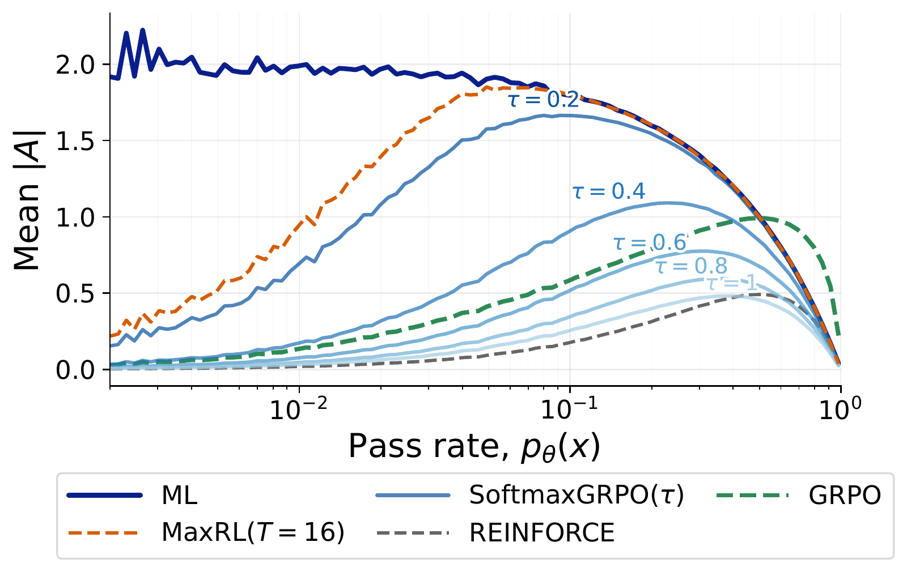
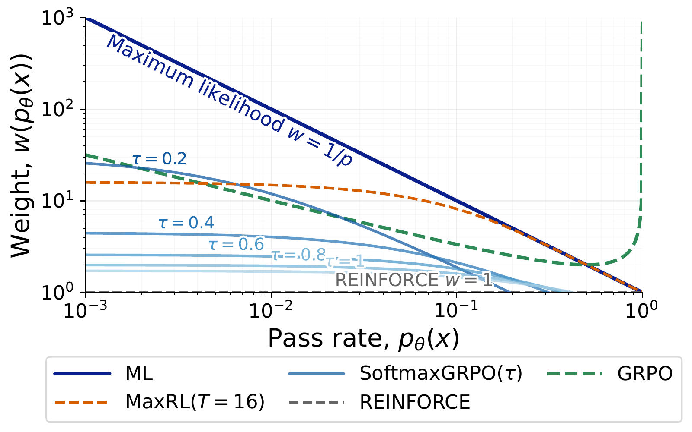

# SoftmaxGRPO: Learning to Reason using Softmax Advantage Group Estimation

PyTorch implementation of SoftmaxGRPO for LLM reasoning and ImageNet classification.

<div align="center">
  
  
  <p><em>Figure 1. SoftmaxGRPO defines a smooth objective family over prompt difficulty. Mean absolute advantage (left) and population prompt weighting (right) across temperatures.</em></p>
</div>

Authors: [Jefferson Hernandez](https://jeffhernandez1995.github.io/), [Jaywon Koo](https://jaywonkoo17.github.io/), [Zilin Xiao](https://zilin.me/), [Chen Wei](https://weichen582.github.io/), [Vicente Ordonez](https://www.cs.rice.edu/~vo9/)

[[`Paper`](https://arxiv.org/abs/2608.09271)] [[`BibTeX`](#citing-softmaxgrpo)]

For each prompt's group of `M` sampled rewards, the estimator is

```python
advantages = M * softmax(rewards / tau) - 1
```

The LLM experiments use upstream [verl v0.6.1](https://github.com/verl-project/verl/tree/v0.6.1)
with a registered `softmaxgrpo` advantage estimator. ImageNet uses the same estimator in a
small PyTorch ResNet-50 training loop. This folder can be copied into its own repository;
it does not import anything from its parent directory. It includes only our method and main
experiment configurations.

## Installation

LLM training requires Linux, NVIDIA GPUs, and a CUDA environment compatible with
PyTorch 2.8. Use Python 3.12 in a fresh environment. From this folder:

```bash
python3.12 -m venv .venv
source .venv/bin/activate
python -m pip install --upgrade pip
python -m pip install -e '.[llm,imagenet,test]'
python -m pip install 'flash-attn==2.8.1' --no-build-isolation
```

The main GPU dependencies are pinned in `pyproject.toml`: verl 0.6.1, vLLM 0.10.2,
PyTorch 2.8, and Transformers 4.56.2. The corresponding upstream verl source is commit
`d62da4950573d7a4b7ef2362337952e7ab59e78d`. The CUDA training stack still needs a GPU smoke
run on the target machine. CPU checks and ImageNet alone do not require vLLM or FlashAttention:

```bash
python -m pip install -e '.[data,imagenet,test]'
pytest
```

## LLM experiments

Run data preparation once per reward setting. It downloads public datasets, resolves their
revisions, and records the source, split policy, and counts in `data/*/manifest.json`.
Use `--revision COMMIT` to reuse a specific dataset snapshot. Model/data downloads are not
bundled. `--train-file` and `--validation-file` accept local source Parquet files with the
same schema as the corresponding public dataset.

```bash
python -m softmaxgrpo.prepare_data --task gsm8k
python -m softmaxgrpo.prepare_data --task countdown
python -m softmaxgrpo.prepare_data --task deepmath --validation-size 1000
python -m softmaxgrpo.prepare_data --task openthoughts
```

| Config | Reward | Group size | Temperature | Prompt batch | Steps | Response tokens | GPUs |
| --- | --- | ---: | ---: | ---: | ---: | ---: | ---: |
| `gsm8k` | Verifier | 8 | 0.1 | 64 | 1,000 | 256 | 8 |
| `countdown` | Verifier | 8 | 0.1 | 64 | 2,000 | 256 | 8 |
| `deepmath` | Verifier | 16 | 0.3 | 512 | 3,220 | 1,024 | 16 |
| `openthoughts` | Similarity + format | 8 | 0.3 | 512 | 3,220 | 6,144 | 16 |

These use `Qwen/Qwen2.5-1.5B`, learning rate `1e-6`, PPO clipping `[0.20, 0.28]`, and
reference KL coefficient `0.001`. Rewards are detached; KL is applied as a separate loss.
Validation logs verifier accuracy separately from the optimization reward.

```bash
bash scripts/train.sh gsm8k
bash scripts/train.sh countdown
# Launch the two-node jobs through Slurm as shown below.
```

For the paper's SoftmaxGRPO-Sim results on the three verifiable tasks, prepare and train
the same task with its similarity setting:

```bash
python -m softmaxgrpo.prepare_data --task gsm8k --reward sim
python -m softmaxgrpo.prepare_data --task countdown --reward sim
python -m softmaxgrpo.prepare_data --task deepmath --reward sim --validation-size 1000
bash scripts/train.sh gsm8k_sim
bash scripts/train.sh countdown_sim
```

`deepmath_sim` is the corresponding two-node configuration. All similarity rewards use
`0.6 * SQuAD_F1 + 0.4 * ROUGE_L_F1` on normalized answer words. Only OpenThoughts also
uses `0.35 * format + 0.65 * similarity`. No verifier score is added to similarity rewards.

GSM8K uses the official train/test splits. Countdown verifier training uses the full
[Countdown-Tasks-3to4](https://huggingface.co/datasets/Jiayi-Pan/Countdown-Tasks-3to4)
dataset; similarity training uses the full `verified_Qwen2.5-7B-Instruct` configuration of
[Countdown-Task-GOLD](https://huggingface.co/datasets/HuggingFaceTB/Countdown-Task-GOLD).
Both use each example's supplied numbers and target, with exact rational arithmetic and
each integer used once. DeepMath selects the shortest available reference solution.
Datasets without an evaluation split use a deterministic holdout grouped by prompt; this
keeps repeated OpenThoughts questions out of both splits. The requested holdout is capped
at 10% of distinct prompts, and the resulting counts are recorded in the manifest.
OpenThoughts validation measures the training reward; its downstream capability evaluation
uses separate benchmarks.

Hydra overrides work on every run. `DATA_DIR`, `OUTPUT_DIR`, `GPUS_PER_NODE`, and `NNODES`
control local paths and resources. For example, a short GPU smoke run on an eight-GPU node:

```bash
bash scripts/train.sh gsm8k trainer.total_training_steps=2 trainer.test_freq=1 \
  trainer.save_freq=1 data.train_batch_size=8 actor_rollout_ref.actor.ppo_micro_batch_size_per_gpu=1
```

Inspect a fully resolved configuration without loading model weights:

```bash
python -m softmaxgrpo.train --config-name gsm8k --cfg job --resolve
```

## Qwen3 experiments

```bash
python -m softmaxgrpo.prepare_data --task qwen3
```

The `qwen3` and `qwen3_4b` configs train `Qwen3-1.7B-Base` and `Qwen3-4B-Base` on Polaris,
respectively. Both use SoftmaxGRPO with `tau=0.3`, 16 rollouts, prompt batches of 256,
learning rate `1e-6`, five epochs, and no reference KL. AIME 2025 and MATH-500 are separate
evaluation datasets, with 32 sampled answers per problem. Their defaults request four
nodes with eight GPUs each; resource counts can be overridden.
Data preparation removes exact evaluation-prompt matches from Polaris and records the
number removed in its manifest.

## Slurm

Submit from this folder after activating the environment. The folder, environment, data,
and checkpoints must be accessible on every allocated node. Pass site-specific account,
partition, and GPU options directly to `sbatch`. The scripts contain no site names,
email addresses, or personal filesystem paths.

```bash
sbatch scripts/slurm/train.sbatch gsm8k
sbatch --nodes=2 scripts/slurm/train.sbatch deepmath
sbatch --nodes=2 scripts/slurm/train.sbatch deepmath_sim
sbatch --nodes=2 scripts/slurm/train.sbatch openthoughts
sbatch --nodes=4 scripts/slurm/train.sbatch qwen3
sbatch --nodes=4 scripts/slurm/train.sbatch qwen3_4b
```

Set `SOFTMAXGRPO_ENV_SCRIPT` to a shared environment activation script if needed.
For a different GPU count, set `GPUS_PER_NODE` and pass the same `--gpus-per-node` value.
Multi-node jobs start one Ray process per allocated node and wait for the full allocation.
Ray processes are scoped to the Slurm job step. `RAY_PORT` can select a different head port.

## ImageNet

Provide ImageNet in ImageFolder layout, with matching 1,000-class subdirectories under
`train/` and `val/`. Images are not redistributed.

```bash
export IMAGENET_DIR=/path/to/imagenet
bash scripts/imagenet.sh
# Or:
sbatch scripts/slurm/imagenet.sbatch
```

The main run trains ResNet-50 from scratch for 20 epochs, batch size 256, with SGD
(`lr=0.1`, momentum `0.9`, weight decay `1e-4`) and a cosine schedule with two warmup
epochs. Each image has 1,024 sampled class labels, binary correctness rewards, and
SoftmaxGRPO temperature `0.2`. Training uses float32. The output directory contains
JSONL metrics, configuration, and `latest.pt`/`best.pt` checkpoints. Validation reports
argmax top-1 and exact sampling probabilities for pass@1 and pass@128.

```bash
bash scripts/imagenet.sh --resume outputs/imagenet/latest.pt
```

## Evaluation and checkpoint export

verl validates during training and saves decoded validation outputs under the experiment's
`validation/` folder. Export an FSDP actor checkpoint to Hugging Face format:

```bash
python -m verl.model_merger merge --backend fsdp \
  --local_dir outputs/gsm8k_exact/global_step_1000/actor \
  --target_dir outputs/gsm8k_hf
python -m softmaxgrpo.evaluate --model outputs/gsm8k_hf \
  --data data/gsm8k_exact/validation.parquet --output outputs/gsm8k_eval.json
```

For OpenThoughts transfer, export its final actor and follow [EVALUATION.md](EVALUATION.md)
for MMLU, GPQA, and AlpacaEval 2.0. These benchmark datasets are never used for training.

## Citing SoftmaxGRPO

If you use this code in your research, please cite our paper:

```bibtex
@inproceedings{hernandez2026softmaxgrpo,
  title = {SoftmaxGRPO: Learning to Reason using Softmax Advantage Group Estimation},
  author = {Hernandez, Jefferson and Koo, Jaywon and Xiao, Zilin and Wei, Chen and Ordonez, Vicente},
  year = {2026},
  booktitle = {Confererence on Language Modeling, COLM 2026},
  url = {https://arxiv.org/abs/2608.09271},
}
```

## Acknowledgments

Our research code used a lot from [MaxRL](https://github.com/tajwarfahim/maxrl), and we thank
its authors for releasing their implementation. We also thank the
[verl contributors](https://github.com/verl-project/verl).
